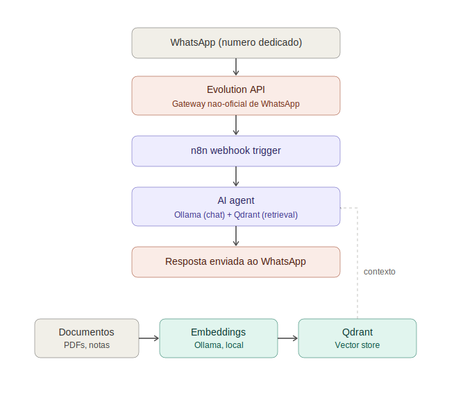

# Local AI Assistant — RAG + WhatsApp + n8n

A fully self-hosted personal AI assistant built with **local LLMs**, **Retrieval-Augmented Generation (RAG)**, and **workflow automation** — no paid cloud APIs required. The assistant runs entirely on local hardware (CPU-only, no GPU needed) and is reachable via WhatsApp.



## ✨ Overview

This project combines a self-hosted low-code automation platform with a local LLM runtime and a vector database to create a personal assistant that can:

- Answer questions using a locally-run language model (no data leaves your machine)
- Retrieve relevant context from a personal knowledge base (PDFs, notes, docs) via RAG
- Be accessed conversationally through WhatsApp
- Run scheduled/automated tasks (reminders, digests, lookups)

The entire stack runs on consumer-grade hardware — no GPU required, tested on a CPU-only setup with 16GB RAM.

## 🧱 Stack

| Component | Role |
|---|---|
| [n8n](https://n8n.io/) | Low-code workflow orchestration & agent logic |
| [Ollama](https://ollama.com/) | Local LLM inference (chat + embeddings) |
| [Qdrant](https://qdrant.tech/) | Vector store for RAG (document retrieval) |
| [Evolution API](https://github.com/EvolutionAPI/evolution-api) | Unofficial WhatsApp gateway (webhook-based) |
| Docker Compose | Container orchestration |

## 🏗️ Architecture

```
WhatsApp (dedicated number)
      │
      ▼
Evolution API (WhatsApp gateway, webhook)
      │
      ▼
n8n Webhook Trigger
      │
      ▼
n8n AI Agent Node
      ├── Ollama Chat Model (local LLM)
      └── Qdrant Vector Store (RAG retrieval)
                ▲
                │
        Ollama Embeddings
                ▲
                │
   Document Ingestion Workflow (PDFs, notes, docs)
```

## 🚀 Getting Started

### Prerequisites

- Docker & Docker Compose
- ~16GB RAM (CPU-only inference supported; no GPU required)
- A dedicated phone number for the WhatsApp integration (recommended, to isolate it from personal use)

### 1. Clone and configure

```bash
git clone https://github.com/<your-username>/local-ai-assistant.git
cd local-ai-assistant
cp .env.example .env
# edit .env with your own values
```

### 2. Start the stack

```bash
docker compose up -d
```

This brings up n8n, Qdrant, and Evolution API. Ollama is expected to run separately (natively or in its own container) — see [docs/setup.md](docs/setup.md).

### 3. Pull the models

```bash
ollama pull llama3.2        # chat model
ollama pull nomic-embed-text  # embeddings model
```

### 4. Connect WhatsApp

1. Open the Evolution API instance and scan the QR code with your dedicated number
2. Import the workflows from `n8n/workflows/` into your n8n instance
3. Configure the webhook URL in Evolution API to point to your n8n webhook

### 5. Ingest your knowledge base

Run the ingestion workflow (`n8n/workflows/ingestion.json`) to index your documents into Qdrant. Drop files into the shared folder and trigger the workflow.

## 📂 Repository Structure

```
.
├── docker-compose.yml       # Qdrant + Evolution API + n8n
├── .env.example             # Environment variable template
├── n8n/
│   └── workflows/           # Exported n8n workflow JSON files
├── docs/
│   ├── architecture.md      # Detailed architecture notes
│   └── setup.md             # Full setup walkthrough
└── assets/                  # Diagrams and screenshots
```

## 💡 Why local-first?

- **Privacy**: no personal data or conversations sent to third-party APIs
- **Cost**: zero recurring API costs — only the (optional) SIM card for WhatsApp
- **Learning**: hands-on experience with LLM orchestration, vector search, and workflow automation

## 🛣️ Roadmap

- [ ] Add support for multiple knowledge bases (per-topic collections in Qdrant)
- [ ] Add conversation memory/persistence
- [ ] Explore lightweight quantized models for faster CPU inference
- [ ] Add scheduled digest workflows

## 📜 License

MIT — see [LICENSE](LICENSE)
